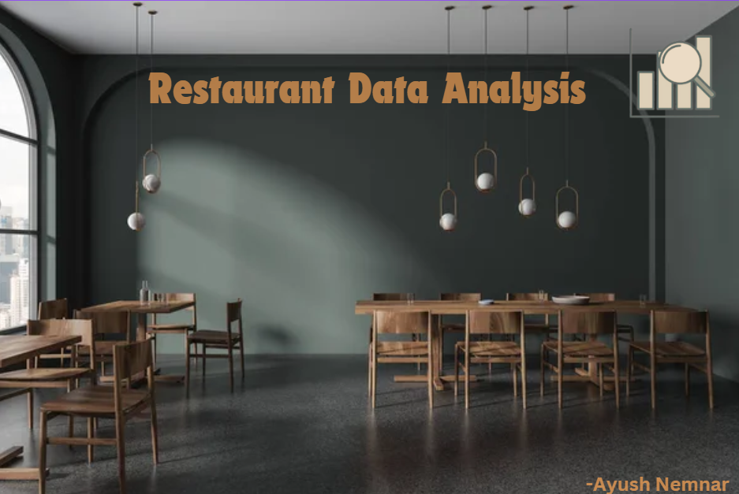

# 🍽️ Restaurant Data Analysis

**📌 Project Overview**
This project focuses on analyzing restaurant orders and performance using SQL. The analysis provides insights into customer behavior, restaurant efficiency, and business performance trends.

**📊 Key Insights & Analysis**

**🔹 Orders Table Analysis**

- Identifying high-spending customers.
- Analyzing peak order times.
- Determining the most popular payment methods.
- Evaluating delivery performance and efficiency.
- Assessing customer satisfaction based on ratings.
- Understanding order size and its impact on revenue.

**🔹 Restaurants Table Analysis**

- Identifying the most popular cuisines by zone.
- Analyzing restaurant performance based on customer satisfaction ratings.
- Understanding cuisine distribution across different zones.

**🔹 Combined Orders & Restaurants Analysis**

- Ranking top revenue-generating restaurants.
- Identifying best-performing zones in terms of orders and revenue.
- Analyzing customer preferences by zone and cuisine type.
- Evaluating order amounts based on different cuisines.

**🛠️ Tech Stack**
- SQL (MySQL) – Data extraction and analysis.
- Python (Pandas, NumPy, Matplotlib) – Data manipulation and visualization.
- Power BI – For interactive dashboards.

**📂 Dataset Structure**

Orders Table
- Order_ID – Unique order identifier
- Order_Date – Timestamp of the order
- Customer_Name – Name of the customer
- Order_Amount – Total price of the order
- Payment_Mode – Payment method used
- Customer_Rating_Food – Rating for food quality
- Customer_Rating_Delivery – Rating for delivery service

Restaurants Table
- RestaurantID – Unique restaurant identifier
- RestaurantName – Name of the restaurant
- Zone – Location of the restaurant
- Cuisine – Type of cuisine served

**🚀 Future Improvements**

- Sentiment analysis of customer reviews
- Predictive analytics for demand forecasting
- Advanced Power BI/Tableau visualizations
